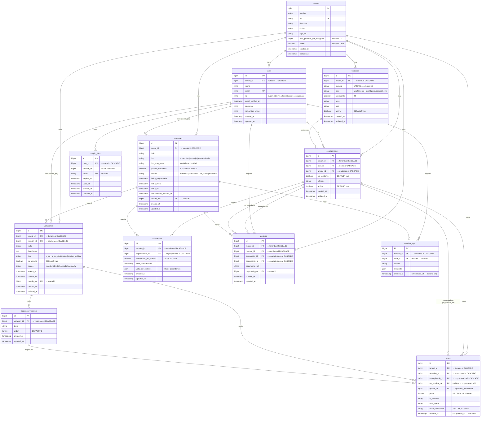

# Diagrama ER — ASAMBLI

## Notas

| Tabla | Restricciones especiales |
|-------|--------------------------|
| `unidades` | UNIQUE `(tenant_id, numero)` |
| `copropietarios` | UNIQUE `(tenant_id, user_id)` |
| `asistencias` | UNIQUE `(reunion_id, copropietario_id)` |
| `votos` | UNIQUE `(votacion_id, copropietario_id, en_nombre_de)` |
| `poderes` | UNIQUE `(reunion_id, poderdante_id)` |
| `votos` | Sin `updated_at` — votos inmutables |
| `reunion_logs` | Sin `updated_at` — log append-only |
| `users` | `tenant_id` nullable para `super_admin` |
| `tenants` | `max_poderes_por_delegado` aplica restricción de negocio en `Poder::booted()` |
